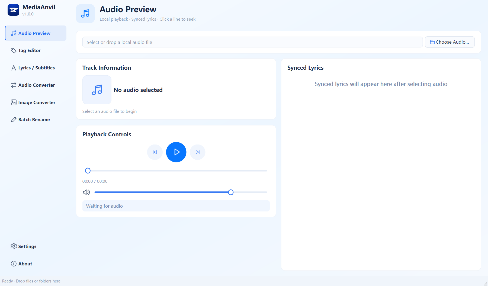
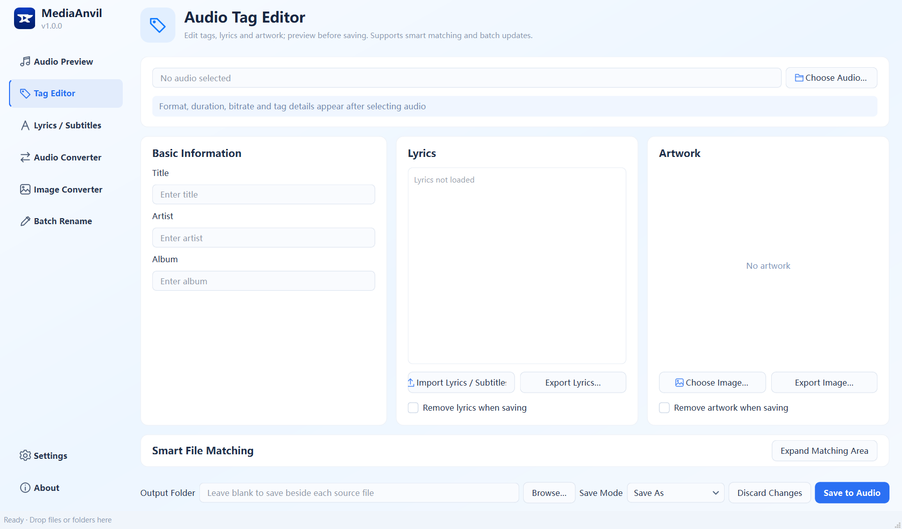
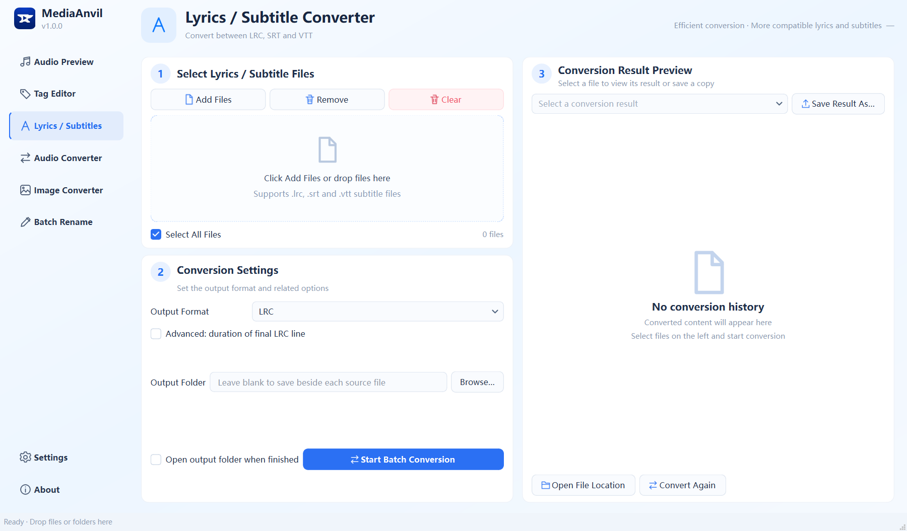
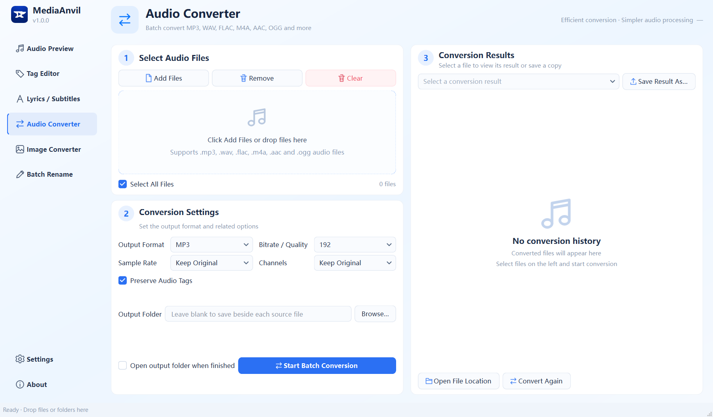
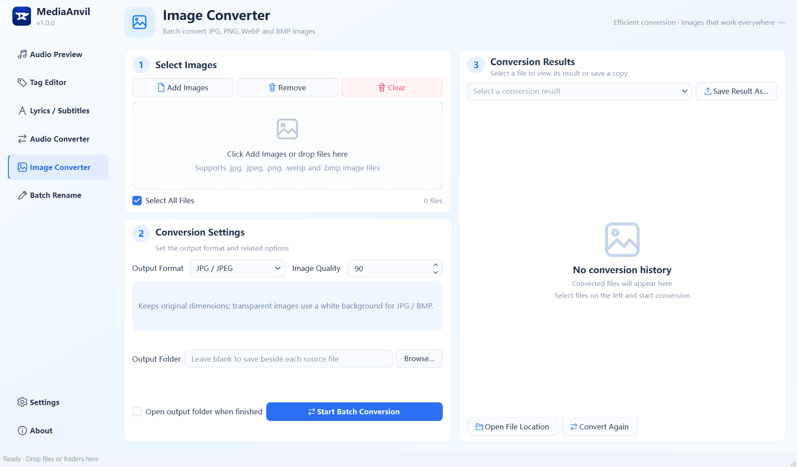
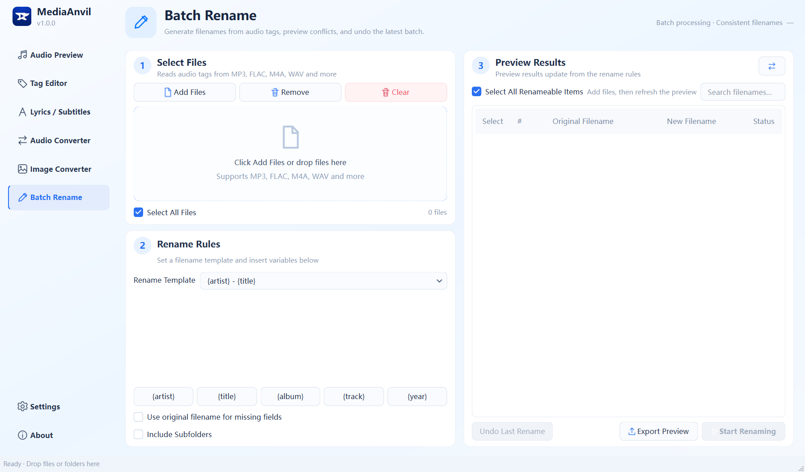
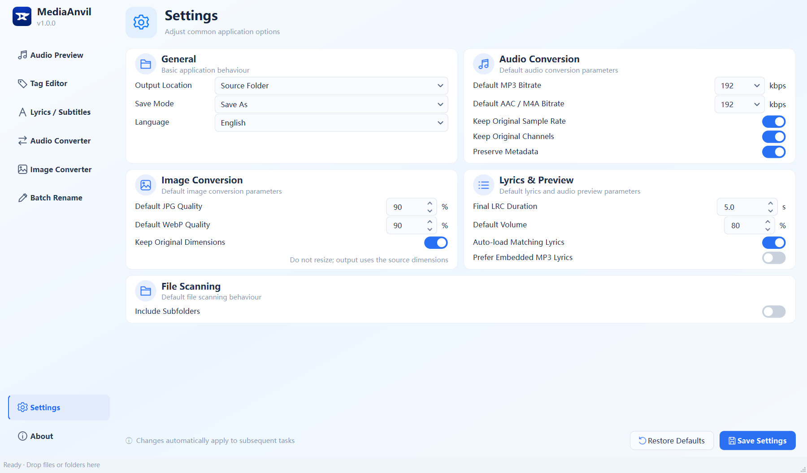

# MediaAnvil 1.0

[](https://github.com/iMankoppai/MediaAnvil/releases/latest)
[](LICENSE)
[](https://github.com/iMankoppai/MediaAnvil/releases/latest)

MediaAnvil is a local media toolbox for Windows. It provides a Qt desktop interface, processes media files entirely on your computer, preserves source files by default, and offers both Simplified Chinese and English interfaces.

For end-user instructions, see the [User Guide](USER_GUIDE.en.md). For source setup and packaging details, see the [Qt Build Guide](README-Qt.en.md).

**[简体中文 →](README.md)**



## Features

- Audio preview: Play MP3, WAV, FLAC, M4A, AAC, OGG, and Opus files, with Space-bar play/pause, skip controls, volume adjustment, and seeking.
- Synchronized lyrics: Read matching LRC, SRT, and VTT files directly. Double-extension names such as `song.wav.vtt` and embedded synchronized MP3 lyrics are supported, with an option to prioritize embedded lyrics.
- Audio tag editor: Edit title, artist, and album fields; import or remove lyrics and cover art. SRT and VTT content is converted to LRC in memory before it is embedded.
- Cover art tools: Preview, import, export, and remove cover art, with free rectangular cropping during import.
- Smart matching: Scan the audio file's directory for lyrics and cover art, recognize conventional and double-extension names, and write selected matches in batches.
- Lyrics and subtitle conversion: Convert between LRC, SRT, and VTT while preserving multiline content and avoiding existing files safely.
- Audio conversion: Batch-convert between MP3, WAV, FLAC, M4A/AAC, and OGG, with bitrate, quality, sample-rate, channel, and metadata-preservation options.
- Image conversion: Batch-convert between JPG, PNG, WebP, and BMP, with quality and transparency handling.
- Batch renaming: Generate filenames from audio metadata, preview conflicts before execution, and undo the most recent rename operation.

## Interface

### Tag, lyrics, and cover editor

Edit audio metadata, import lyrics or subtitles, and preview, crop, or export cover art from one page. The smart matching panel can associate files from the same directory in batches.



### Lyrics and subtitle conversion

Batch-convert between LRC, SRT, and VTT, then preview the converted text directly in the panel on the right.



### Batch format conversion

Add, select, and remove files through a consistent workflow, configure output options, and review or save conversion results from the panel on the right.



### Image format conversion

Batch-convert JPG, PNG, WebP, and BMP images while preserving dimensions and handling transparency appropriately for the target format.



### Batch renaming

Generate filenames from audio metadata, preview conflicts before execution, and undo the most recent successful batch rename.



### Centralized settings

Configure save behavior, conversion quality, lyrics preview, and file scanning in one place.



## Safe behavior

- The tag editor uses Save As by default. Source files are replaced only when Overwrite Source is explicitly selected.
- Conversion output automatically uses suffixes such as `_1` and `_2` to avoid existing files.
- Remove and Clear only update the on-screen lists; they do not delete files from disk.
- Importing or previewing SRT and VTT files does not modify the original subtitles or create temporary LRC files beside them.
- The application prevents the window from closing while background work is still running, reducing the risk of interrupted writes.

## Run the Windows release

Download and extract the complete `MediaAnvilQt` folder, then run:

```text
MediaAnvilQt.exe
```

Keep the `_internal` directory beside the executable; do not copy the EXE by itself. Qt, FFmpeg, and FFplay are included, so Python is not required on the target computer.

The application starts centered at `1440 × 900` (16:10) by default and automatically scales down for smaller or high-DPI displays.

## Run from source

Use an official Windows build of Python 3.10 or later:

```powershell
python -m venv .build-venv-windows
.build-venv-windows\Scripts\python.exe -m pip install -r requirements-qt.txt
.\tools\download_ffmpeg.ps1
.\tools\download_icu.ps1
.build-venv-windows\Scripts\python.exe main_qt.py
```

Run the complete test suite:

```powershell
.build-venv-windows\Scripts\python.exe -m unittest discover -s tests -v
```

Build the Windows release:

```powershell
.build-venv-windows\Scripts\python.exe -m pip install -r requirements-build.txt
.\build-qt.ps1
```

When needed, the build script downloads checksum-verified, fixed versions of FFmpeg and ICU. It creates `dist\MediaAnvilQt` and automatically verifies that the frozen application starts, FFmpeg performs a real conversion, and FFplay is available.

## Supported formats

- Synchronized lyrics and subtitles: LRC, SRT, VTT
- Writable audio metadata: MP3, FLAC, M4A, OGG, Opus
- WAV metadata: read-only
- Audio conversion: MP3, WAV, FLAC, M4A/AAC, OGG
- Image conversion: JPG/JPEG, PNG, WebP, BMP
- Text encoding: UTF-8, UTF-16, and GB18030; converted text is written as UTF-8 with BOM

## Third-party components

Licenses and source information for Qt/PySide6, ICU, and FFmpeg/FFplay are documented in [THIRD_PARTY_NOTICES.md](THIRD_PARTY_NOTICES.md) and the `licenses/` directory.

## License

MediaAnvil is released under the [MIT License](LICENSE). Third-party components remain subject to their respective licenses.
