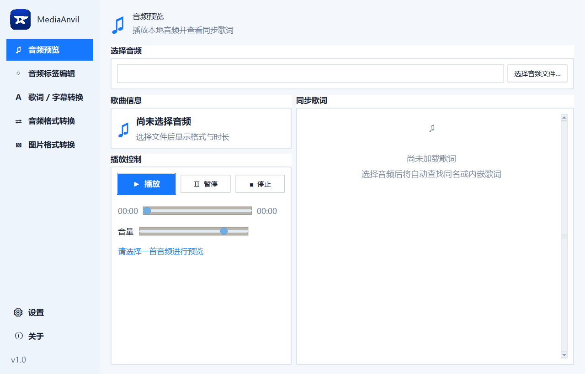

# Sub2LRC

Sub2LRC 正在发展为一个 Windows 本地多媒体工具箱，支持歌词/字幕、音频标签、音频格式和图片格式处理，支持中文与批量转换。



## 歌词 / 字幕格式转换

1. 下载并双击运行 `Sub2LRC.exe`。
2. 点击“选择歌词 / 字幕”，可以同时选择多个 LRC、SRT 或 VTT 文件；程序会自动识别输入格式。
3. 选择输出格式和输出目录。
4. 点击“开始批量转换”。
5. 在预览区检查结果，文件会自动保存到输出目录。

所有格式先解析为统一的“开始时间、结束时间、文字”数据，再生成目标格式。LRC 转 SRT / VTT 时，上一句默认在下一句开始时结束；最后一句的持续时间可配置，默认 5 秒。字幕中的多行文字会保留；转为 LRC 时每行使用相同的开始时间。已有同名文件时会自动生成 `_1`、`_2` 等新文件，不会覆盖输入或已有文件。

## MP3 编辑

1. 切换到“音频标签编辑”页签，只需选择一次歌曲。
2. 程序会读取歌名、歌手、专辑、内嵌歌词和封面并显示预览。
3. 按需修改基础信息、导入或移除歌词、选择或移除封面。
4. 默认使用更安全的“另存为”；也可以主动选择“覆盖原文件”，点击“保存到 MP3”一次完成全部修改。

“取消修改”可以放弃当前尚未保存的全部编辑并恢复刚读取到的内容，不会修改磁盘上的 MP3。

选择 MP3 后会同时显示格式、时长、码率、采样率、声道、文件大小和 ID3 标签数量。歌词区和封面区可以把当前已保存的内嵌内容导出：带 LRC 时间戳的歌词导出为 `.lrc`，普通歌词导出为 `.txt`，同步歌词会生成 LRC；封面根据真实图片内容导出为 `.jpg` 或 `.png`。已有同名文件时自动生成新文件名，不会覆盖。

封面图片支持 JPG、JPEG 和 PNG，写入前可以手动裁剪为 1:1。歌词、封面和基础信息的底层格式保持不变；未修改的内容不会重写或删除，音频不会重新编码。覆盖模式先编辑临时副本并校验，成功后才替换原文件；另存为不会修改源文件，程序不会生成 `.bak`。

## 音频转换

1. 切换到“音频格式转换”页签，选择一个或多个 MP3、WAV、FLAC、M4A、AAC 或 OGG 文件。
2. 选择输出格式。MP3 和 AAC/M4A 可选码率，FLAC 可选压缩等级，OGG 可选质量等级。
3. 默认保持原始采样率和声道，也可以明确选择新的采样率或声道数。
4. 选择输出目录并点击“开始转换”。

音频编码由内置 FFmpeg 完成，正式发布的单文件 EXE 不需要用户另外安装或配置 FFmpeg。源码运行时也支持系统 `PATH` 或程序同目录的 `ffmpeg.exe`。输出保留原文件名并替换扩展名；已有同名文件时会生成 `_1`、`_2` 等安全的新文件名。输出格式与源格式相同时会拒绝转换。

## 音频预览

“音频预览”页支持 MP3、WAV、FLAC、M4A、AAC 和 OGG，提供播放、暂停、停止、进度跳转、当前/总时长及音量控制。它只读取并播放当前选择的单个文件，不会修改音频或建立歌单。

如果音频旁存在同名 `.lrc`，程序会优先载入该歌词；MP3 没有同名歌词时会尝试读取内嵌的 LRC 时间歌词。播放时居中显示纯歌词列表，当前句会高亮并自动滚动到视图中部；点击任意一句歌词即可跳转到对应播放时间。没有同步歌词时仍可正常播放。

## 图片格式转换

1. 切换到“图片格式转换”页签，选择一张或多张 JPG、JPEG、PNG、WebP 或 BMP 图片。
2. 选择目标格式；输出 JPG 或 WebP 时可以设置 1–100 的图片质量。
3. 选择输出目录并点击“开始转换”。

程序根据图片内容自动识别格式，默认保持原始宽高。PNG 和 WebP 可以保留透明区域；转为不可靠支持透明背景的 JPG 或 BMP 时，透明区域会使用白色背景，并在完成后明确提示。已有同名文件时会自动生成新文件名，源图片不会被覆盖。单张图片失败不会中断后续批量转换。

## 下载 EXE

前往 [Releases](https://github.com/iMankoppai/Sub2LRC/releases/latest) 下载最新版 `Sub2LRC.exe`。目标电脑不需要安装 Python。

## 支持格式

- 歌词 / 字幕输入与输出：`.lrc`、`.srt`、`.vtt`（三种格式相互转换）
- MP3 内嵌歌词：`.mp3` + `.lrc`
- MP3 内嵌封面：`.mp3` + `.jpg` / `.jpeg` / `.png`
- 音频转换输入/输出：`.mp3`、`.wav`、`.flac`、`.m4a`、`.aac`、`.ogg`
- 图片转换输入/输出：`.jpg`、`.jpeg`、`.png`、`.webp`、`.bmp`
- 输入编码：UTF-8、UTF-16、GB18030
- 输出编码：带 BOM 的 UTF-8
- 文件名转换示例：`歌曲.wav.vtt` → `歌曲.lrc`

## 已知问题

- Windows 首次运行未签名的 EXE 时，SmartScreen 可能显示“未知发布者”。
- LRC 格式本身通常不保存结束时间；转为 SRT / VTT 时会按下一句开始时间及设定的最后一句持续时间补全。
- VTT 的显示控制标签会被移除，因为 LRC 不支持这些标签。
- 歌词写入标准 ID3 `USLT` 标签；个别不读取该标签的播放器可能无法显示。
- PotPlayer 可以读取当前内嵌歌词中的 LRC 时间并同步显示；网易云音乐更适合使用同名外置 LRC。
- MP3 同时包含多个歌词或封面标签时，导出会优先选择本软件写入的歌词和正面封面，并明确提示检测到的数量。
- 当前版本仅提供 Windows EXE。
- 单文件 EXE 首次启动音频转换时需要短暂解压内置 FFmpeg，因此可能比后续转换稍慢。
- 调整播放音量时预览进程会从当前位置快速重启，可能出现很短的声音间隔。
- JPG 不支持透明背景；BMP 的透明效果在不同软件中兼容性不一致，因此这两种输出统一使用白色背景处理透明区域。

## 从源码运行

需要 Python 3.10 或更高版本：

```powershell
python -m pip install -r requirements.txt
python main.py
```

运行测试：

```powershell
python -m unittest discover -s tests -v
```

重新打包：

```powershell
powershell -ExecutionPolicy Bypass -File .\build.ps1
```
