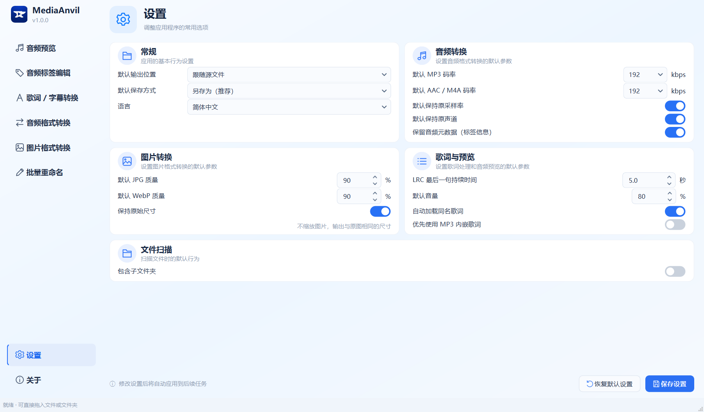

# MediaAnvil 1.5.1

[](https://github.com/iMankoppai/MediaAnvil/releases)
[](LICENSE)
[](https://github.com/iMankoppai/MediaAnvil/releases)

MediaAnvil 是一款面向 Windows 的本地多媒体工具箱。它使用 Qt 桌面界面，媒体文件始终在本机处理，默认保留原文件，并提供简体中文与英文界面。

普通用户请阅读 [使用说明](USER_GUIDE.md)，源码运行与打包细节见 [Qt 构建说明](README-Qt.md)。

**[English →](README.en.md)**


## 主要功能

- 音频预览：播放 MP3、WAV、FLAC、M4A、AAC、OGG、Opus，支持空格播放/暂停、前后跳转、音量和进度控制。
- 同步歌词：直接读取同名 LRC、SRT、VTT，也支持 `歌曲.wav.vtt` 等双后缀命名和 MP3 内嵌同步歌词；可以设置 MP3 内嵌歌词优先。
- 音频标签编辑：修改歌名、歌手、专辑，导入或移除歌词与封面；SRT/VTT 会在内存中转换为 LRC 后写入。
- 封面处理：预览、导入、导出、移除封面，导入时提供自由矩形裁剪。
- 智能匹配：扫描同目录歌词和封面，支持普通及双后缀命名，可批量写入所选关联文件。
- 歌词/字幕转换：LRC、SRT、VTT 三种格式互转，保留多行内容并安全避开已有文件。
- 音频合并 / 分割 / 裁剪：多段拼接、按段数或时长分割，以及按波形选区裁剪；可选淡入淡出与响度标准化。
- 音频转换：MP3、WAV、FLAC、M4A/AAC、OGG 批量互转，支持码率、质量、采样率、声道与标签保留设置。
- 图片转换：JPG、PNG、WebP、BMP 批量互转，支持质量和透明背景处理。
- 批量重命名：根据音频标签生成文件名，音频改名时自动同步同名歌词和封面；执行前预览冲突，支持撤销最近一次批量重命名。
- 任务中心：集中查看批量转换与重命名的每个文件状态，失败项可一键重试；任务运行时可继续浏览其他页面。
- 任务预设：把常用格式、质量和输出目录保存为一键预设；批量标签写入前可预览“原值 → 新值”对照。
- 媒体检查：快速扫描音乐文件夹，找出缺歌词、缺封面或缺关键标签的文件。

## 界面展示

### 标签、歌词与封面编辑

在同一页修改音频标签，导入歌词或字幕，并预览、裁剪和导出封面。智能匹配区域可以批量关联同目录文件。


### 歌词与字幕转换

在 LRC、SRT 和 VTT 之间批量转换，并在右侧直接预览转换后的文本。


### 音频格式转换

统一添加、选择和移除文件，设置输出参数，并在右侧查看和另存转换结果。


### 图片格式转换

批量转换 JPG、PNG、WebP 和 BMP，并保留尺寸或按目标格式处理透明区域。


### 批量重命名

根据音频标签生成文件名，执行前预览冲突，并可撤销最近一次成功的批量重命名。


### 统一设置

集中设置保存方式、转换质量、歌词预览和文件扫描行为。



## 安全行为

- 标签编辑默认“另存为”，只有明确选择“覆盖原文件”才会替换源文件。
- 转换输出自动使用 `_1`、`_2` 等名称避开已有文件。
- “移除”和“清空”只清理界面列表，不删除磁盘文件。
- SRT/VTT 导入与预览不会修改原字幕，也不会在源目录生成临时 LRC。
- 后台任务结束前会阻止关闭窗口，避免处理中途损坏文件。

## 运行发行版

| 版本 | 平台 | 说明 |
| --- | --- | --- |
| [v1.5.1](https://github.com/iMankoppai/MediaAnvil/releases/tag/v1.5.1) | Windows x64 | **最新版**：任务恢复、波形性能优化、媒体检查修复入口、持久化撤销 |
| [v1.5.0](https://github.com/iMankoppai/MediaAnvil/releases/tag/v1.5.0) | Windows x64 | 任务中心、媒体检查、波形裁剪、关联文件同步改名 |
| [v1.4.0](https://github.com/iMankoppai/MediaAnvil/releases/tag/v1.4.0) | Windows x64 | 上一版本：播放队列、倍速、断点续播、批量歌词偏移 |
| [v1.2.0](https://github.com/iMankoppai/MediaAnvil/releases/tag/v1.2.0) | Windows x64 | 音频合并与分段、批量标签修改 |

全部版本见 [Releases](https://github.com/iMankoppai/MediaAnvil/releases)。

下载并解压完整的 `MediaAnvilQt` 文件夹，然后运行：

```text
MediaAnvilQt.exe
```

请保留 `_internal` 目录，不要只复制 EXE。发行版已内置 Qt、FFmpeg 和 FFplay，目标电脑不需要安装 Python。

程序默认以 `1440 × 960`（3:2）窗口启动并居中；高 DPI 或较小屏幕会自动按比例适配。

## 从源码运行

当前源码还包含尚未发布的整理流程、任务排队、连续播放、快速导出和结果核验升级；上面的 1.5.1 下载链接仍指向原发行版。新增行为见使用说明第 14、15 节。

使用官方 Windows Python 3.13（与 CI 验证环境一致）：

```powershell
py -3.13 -m venv .build-venv-windows
.build-venv-windows\Scripts\python.exe -m pip install -r requirements-qt.txt
.\tools\download_ffmpeg.ps1
.build-venv-windows\Scripts\python.exe main_qt.py
```

运行全部测试：

```powershell
.build-venv-windows\Scripts\python.exe -m unittest discover -s tests -v
```

构建 Windows 发行版：

```powershell
.build-venv-windows\Scripts\python.exe -m pip install -r requirements-build.txt
.\build-qt.ps1
```

构建脚本会在需要时下载并校验固定版本的 FFmpeg/FFplay；ICU 使用 Windows 系统运行时，生成 `dist\MediaAnvilQt`，并自动验证冻结版程序启动、FFmpeg 实际转换和 FFplay 可用性。

## 支持范围

- 同步歌词与字幕：LRC、SRT、VTT
- 可写音频标签：MP3、FLAC、M4A、OGG、Opus
- WAV 标签：只读
- 音频转换：MP3、WAV、FLAC、M4A/AAC、OGG
- 图片转换：JPG/JPEG、PNG、WebP、BMP
- 文本编码：UTF-8、UTF-16、GB18030；转换输出为带 BOM 的 UTF-8

## 第三方组件

Qt/PySide6、ICU 与 FFmpeg/FFplay 的许可和来源说明见 [THIRD_PARTY_NOTICES.md](THIRD_PARTY_NOTICES.md) 与 `licenses/`。

## 许可证

MediaAnvil 使用 [MIT License](LICENSE) 开源。第三方组件仍分别适用其各自许可证。
